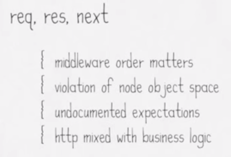

# REST api with hapi

###Cody Zuschlag


* Member [hoodie](http://hood.ie) project (server using hapi + pouchdb)
* express.js REST apis for **Axway Engage**
* New keystore microservice using hapi for **Axway Engage**
* Passionate for everything node.js!


# express.js


# amazing!


## middlewares & routes



_from [https://youtu.be/Recv7vR8ZlA](https://youtu.be/Recv7vR8ZlA)_


## middlewares & routes

* middlewares === chain of functions
* routes matched by regex
* req / res -> wrapped native node objects with added fields

Note:
dirty, changes to node ~> broken?
mixes http and business logic (hard to decouple)


## middlewares & routes

* **order matters!** body-parser _before_ cookie-parser
* now all body objects are read into memory
  * _no limit on size_ (out of memory!)
* complicated to stream directly into file

Note:
* undocumented dependencies (and order) between middlewares!
* parse (by default) does not limit size of payload (out of memory!) (unknown unless you look at implementation)


# hapi.js


# not bad...


## history

* born in yahoo -> walmart
* mobile site (single point, proxy)
* "heavy on network, light on processing... streaming"
* built on express.js


## why

1. big teams
2. code isolation


## differences

* modular, no middlewares, everything plugins, some events
* plugins
  * inter-plugin dependencies


# wishlist


# principles


_from https://youtu.be/Recv7vR8ZlA?t=15m19s _

* config over code
  * can write code, but can _also_ do as much as possible with config
  * input/output validation (schema)


## validation

* in node difficult to have conditional validation (if quary param then no body, etc) with callbacks


### express is small (few hundred lines of code), hapi is big?

features start in core -> moved to plugin if not 'core' feature


# 100% coverage

"for every percent between 85 and 100... we found at least 1 bug"


[pouchdb.com](pouchdb.com)

* open source javascript db
* browser **and** node.js
* "offline first" (mobile: offline should _not_ be an error)
* db for npm
* works with couchdb protocol


## backends

* couchdb
* cloud
* leveldb/leveldown (in-memory, sqlite, sql)


## documents
* json
* \_id
* \_rev (optimistic concurrency)

```
{
  "_id": "dfasf",
  "_rev": "dfsfaf",
  "name": "my name",
  "description": "description"
}
```


## indexes

Use them!

* https://pouchdb.com/2014/06/17/12-pro-tips-for-better-code-with-pouchdb.html
* https://pouchdb.com/2014/05/01/secondary-indexes-have-landed-in-pouchdb.html


## Outline

1. hello world
1. plugins
1. declaritive config
1. validation (get/post)
1. pouchdb
1. models
1. pre-handlers (http://hapijs.com/api#route-prerequisites)
1. tests


## Outline v2

1. Introduction
  1. hello world
  1. getByName
1. configuration / plugins / swagger
  1. config (glue)
  1. blip+good
  1. swagger+tag apis (fix console URL include /documentation)
1. CRUDL (almost)
  1. post (in memory db)
  1. getAll
  1. complete validations (+swagger doc, examples/defaults, could do sooner)
1. code organization (plugins)
  1. api to plugin
  1. prefixes to config
  1. handlers into config, extract config to file
  1. extract handlers
  1. extract validations to file
1. models
  1. create org model (memdown, pouchdb in constructor)
  1. demo: pouch in memory vs persistent (leave in memory) (can change order)
  1. demo: test model index (or test?)
  1. create model plugin
  1. load plugin in config
  1. getAll -> model
  1. model in all handlers
1. error handling
  1. errors: catch(reply)
  1. errors: catch(reply: boom)
  1. info: vs global handler (`'onPreResponse'`, http://hapijs.com/api#error-transformation)
1. response preparation -> `pre`s and modular handlers
  1. prepare response inline (getByName)
  1. demo prepare in function, misses access to request
  1. prepare as pre handler
  1. refactor handlers: use arrays for common type
  1. bug: post -> 200, want 201
  1. add ok and created handler
1. tests (out of scope)


## TODO

1. rename urls (add orgs prefix from begining)
1. add swagger docs soon so we can use swagger UI?
1. simplify good config sooner
1. add swagger examples sooner?
1. name param validation to validations.js
1. pass pouch as constructor to model from begining (reduce refactoring)


# Exercises
1. ...
1. create plugin for models
1. use models plugin in handler (after decorating server)
1. after adding first 'pre' handler, refactor remaining handlers


# Out of Scope
## _see also_

* templates & views
* request lifecycle
* generic error handler / failActions


## Hello world

```javascript
import hapi from 'hapi'

const server = new hapi.Server()
server.connection({port: 3000})

server.route({
  method: 'GET',
  path: '/',
  handler: (request, reply) => {
    reply('Hello world!')
  }
})

server.start((err) => {
  if (err) {
    throw err
  }

  console.log(`Server running at: ${server.info.uri}`)
})
```


# links
## hapi

* https://youtu.be/B3u0XkbhleA?list=PLB7q09icyCHVp3YLoYigTK5JisixHEBf6
* https://youtu.be/Recv7vR8ZlA?list=PLB7q09icyCHVp3YLoYigTK5JisixHEBf6
* https://youtu.be/ybX2s_sFdnk?list=PLB7q09icyCHVp3YLoYigTK5JisixHEBf6


## pouchdb

* https://youtu.be/7L7esHWAjSU


# prerequisites

* [git](https://git-scm.com/)
* [node](https://nodejs.org/en/download/) v5 or v6
  * [nvm](https://github.com/creationix/nvm) is better!
* [npm](https://www.npmjs.com/) (included in node)


## editor
* [atom](https://atom.io/) _used by me_
  * [linter-js-standard](https://atom.io/packages/linter-js-standard)
  * [ternjs](https://atom.io/packages/atom-ternjs)
* [sublime v3](https://www.sublimetext.com/3)
  * [sublimelinter-contrib-standard](https://github.com/Flet/SublimeLinter-contrib-standard) _see also [standardjs](http://standardjs.com/index.html#text-editor-plugins)_
  * [ternjs](https://github.com/ternjs/tern_for_sublime)
* [visualstudio code](https://code.visualstudio.com/)
  * [vscode-standard](https://github.com/shinnn/vscode-standard)

_note: you will have the best experience with one of the above (no intellij)_
