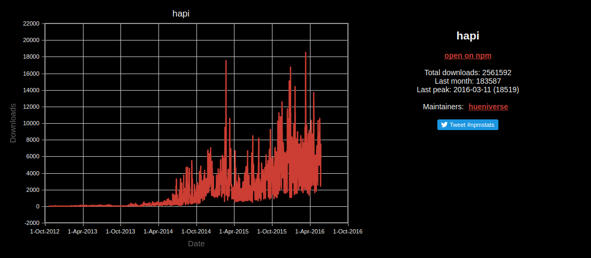

# HAPIer REST APIs

### Cody Zuschlag

Senior Software Engineer

Axway Engage

Note:
"n'importe quelle moment..."
"dans 15 minutes"


* Member [hoodie](http://hood.ie) project (server using hapi + pouchdb)
* express.js REST apis for **Axway Engage**
* New keystore microservice using hapi for **Axway Engage**
* Passion for everything node.js!

Note:
"resoudre" -> resolve


# [expressjs.com](http://expressjs.com)

Note:
* exists since 2012
* sur internet


# amazing!


_25 May 2016_


# middlewares & routes

* middlewares === chain of functions <!-- .element: class="fragment fade-in" -->
* req / res <!-- .element: class="fragment fade-in" -->
* routes matched by regex <!-- .element: class="fragment fade-in" -->

Note:

* **order matters!**
* body-parser _must be before_ cookie parser (or passport): undocumented dependencies (and order) between middlewares!
* req / res are **wrapped native node objects**
* dirty, changes to node ~> broken?
* mixes http and business logic (hard to decouple)
  * "no clean seperation between business logic and framework"
* ~~parser reads body objects into memory before parsing _no limit on size_ (out of memory!)~~ Not true with express 4
* ~~node by default uses streams for http connection, express makes it difficult to not parse *all the time*~~


_- [Eran Hammer of WalMart Labs presents hapi (YouTube)](https://youtu.be/Recv7vR8ZlA?list=PLB7q09icyCHVp3YLoYigTK5JisixHEBf6)_


<!-- .slide: data-background-image="http://i.giphy.com/pcC2u7rl89b44.gif" -->


# [hapijs.com](http://hapijs.com)


# And now...


<!-- .slide: data-background-image="images/hapi.png" data-background-size="100px" data-background-repeat="round" -->
<iframe data-autoplay class="stretch" width="853" height="480" src="https://www.youtube.com/embed/y6Sxv-sUYtM?rel=0&amp;showinfo=0&start=132&end=162" frameborder="0" allowfullscreen></iframe>


# not bad...


_25 May 2016_


# history

* born in yahoo -> walmart <!-- .element: class="fragment fade-up" -->
* mobile site (single point, proxy) <!-- .element: class="fragment fade-up" -->
  * node.js: "heavy on network, light on processing... streaming"
* originally built on express.js <!-- .element: class="fragment fade-up" -->
* today: powers all mobile APIs at Walmart <!-- .element: class="fragment fade-up" -->
* soon: powering all e-commerce at Walmart <!-- .element: class="fragment fade-up" -->

Note:
* Walmart: world's largest company by revenue (Fortune Global 500 list in 2014)
  * chiffre d'affaire
* Walmart: biggest private employer in the world (2.2 million employees)


# why

1. limitations in other frameworks
1. big teams
1. code isolation


## differences

* modular: <!-- .element: class="fragment fade-up" -->
  * no middlewares
  * everything plugins (+ some events)
* plugins: <!-- .element: class="fragment fade-up" -->
  * code isolation -> better for big teams
  * inter-plugin dependencies
* configuration over code: <!-- .element: class="fragment fade-up" -->
  * do as much as possible with config!
* caching built-in <!-- .element: class="fragment fade-up" -->

Note:

* big teams / code isolation: not as important for microservices, but still interesting


## Principle: config over code

* <!-- .element: class="fragment fade-up" data-fragment-index="1" --> everything possible in code...
* <!-- .element: class="fragment fade-up" data-fragment-index="2" --> _as much as possible with config!_
* <!-- .element: class="fragment fade-up" data-fragment-index="3" --> input/output validation (schema)
* <!-- .element: class="fragment fade-up" data-fragment-index="3" --> reflection (create documentation, generate stubs)
* <!-- .element: class="fragment fade-up" data-fragment-index="3" --> can validate config (bad keys, bad values) -> reduces errors
* <!-- .element: class="fragment fade-up" data-fragment-index="3" --> more reusable (easier to copy config vs code)

Note:

* stubs for java/objective-C, i.e. for android devs don't have update all of there java class for serialization


## try to keep minimum interactions with framework

* ### config -> framework
* ### code -> business logic


## Features

<ul>
  <li class="fragment fade-up">
    <h3>validation</h3>
    <ul>
      <li>difficult to have conditional validation (if quary param then no body, etc)</li>
      <li>especially in node with if asynchronous</li>
    </ul>
  </li>
  <li class="fragment fade-up"><h3>utilities (static files, dirs, proxies)</h3>
  <li class="fragment fade-up"><h3>views (basic template support)</h3>
</ul>


# BIG framework?

### express is small (few hundred lines of code)...
### hapi is big?

features start in core
<!-- .element: class="fragment fade-in" -->

if feature adds value, stays integrated in framework, else move to plugin
<!-- .element: class="fragment fade-in" -->

Note:

* node.js, we say "no big frameworks!"
* the result is a highly functional, integrated framework


# 100% coverage

### "for every percent between 85 and 100... we found at least 1 bug"

_- Eran Hammer_


# Code

_see [prerequisites](#/prerequisites)_


## Setup + Install

```
git clone https://github.com/codyzu/hapi-demo.git
cd hapi-demo
git checkout dojo
npm install
```


## Hello world

```javascript
import hapi from 'hapi'
```
<!-- .element: class="fragment fade-up" data-fragment-index="1" -->
```javascript
const server = new hapi.Server()
server.connection({port: 3000})
```
<!-- .element: class="fragment fade-up" data-fragment-index="2" -->
```javascript
server.route({
  method: 'GET',
  path: '/',
  handler: (request, reply) => {
    reply('Hello world!')
  }
})
```
<!-- .element: class="fragment fade-up" data-fragment-index="3" -->
```javascript
server.start((err) => {
  if (err) {
    throw err
  }

  console.log(`Server running at: ${server.info.uri}`)
})
```
<!-- .element: class="fragment fade-up" data-fragment-index="4" -->


## config

```javascript
{
  // hapi server options
  server: {},

  // hapi connections
  connections: [ {
    port: 3000
  } ],

  // hapi plugin registrations
  registrations: []
}
```


```javascript
import config from './config'
import glue from 'glue'
```
<!-- .element: class="fragment fade-right" data-fragment-index="1" -->
```javascript
glue.compose(config, {relativeTo: __dirname}, (err, server) => {
  if (err) {
    throw err
  }
```
<!-- .element: class="fragment fade-left" data-fragment-index="2" -->
```javascript
  server.start((err) => {
    if (err) {
      throw err
    }

    server.route({
      method: 'GET'
      // ...
    })

    console.log(`Server running at: ${server.info.uri}`)
  })
```
<!-- .element: class="fragment fade-left" data-fragment-index="3" -->
```javascript
})
```
<!-- .element: class="fragment fade-right" data-fragment-index="1" -->


### getByName

```javascript
server.route({
```
<!-- .element: class="fragment fade-right" data-fragment-index="1" -->
```javascript
  method: 'GET',
  path: '/orgs/{name}',
```
<!-- .element: class="fragment fade-left" data-fragment-index="2" -->
```javascript
  handler: (request, reply) => {
    console.log(`hello ${request.params.name}!`)
    reply(`hello ${request.params.name}!`)
  },
```
<!-- .element: class="fragment fade-left" data-fragment-index="3" -->
```javascript
  config: {
    validate: {
      params: {
        name: joi.string().max(10)
      }
    }
  }
```
<!-- .element: class="fragment fade-left" data-fragment-index="4" -->
```javascript
})
```
<!-- .element: class="fragment fade-right" data-fragment-index="1" -->


### post

```javascript
server.route({
```
<!-- .element: class="fragment fade-right" data-fragment-index="1" -->
```javascript
  method: 'POST',
  path: '/orgs',
```
<!-- .element: class="fragment fade-left" data-fragment-index="2" -->
```javascript
  handler: (request, reply) => {
    console.log(`posting ${request.payload}`)
    reply(request.payload).code(201)
  },
```
<!-- .element: class="fragment fade-left" data-fragment-index="3" -->
```javascript
  config: {
    tags: ['api'],
    validate: {
      payload: joi.object({
        name: joi.string().max(10).required(),
        email: joi.string().email().required()
      }).unknown(),
      options: {
        stripUnknown: true
      }
    }
  }
```
<!-- .element: class="fragment fade-left" data-fragment-index="4" -->
```javascript
})
```
<!-- .element: class="fragment fade-right" data-fragment-index="1" -->


## getAll

```javascript
server.route({
  method: 'GET',
  path: '/orgs',
  handler: (request, reply) => {
    const orgs = Object.values(db)
    console.log('GET ALL:', orgs)
    reply(orgs)
  },
  config: {
    tags: ['api']
  }
})
```
<!-- .element: class="fragment fade-up" data-fragment-index="1" -->


## Plugin

```javascript
import pack from '../package.json'
import * as config from './config'

export function register (server, options, next) {
  // do plugin stuff

  next()
}

register.attributes = {
  name: 'orgs',
  version: pack.version
}
```


## Plugin 2

```javascript
export function register (server, options, next) {
  server.route({
    method: 'GET',
    path: '/orgs',
    config: config.getAll
  })

  server.route({
    method: 'GET',
    path: '/orgs/{name}',
    config: config.getByName
  })

  server.route({
    method: 'POST',
    path: '/orgs',
    config: config.post
  })

  next()
}
```


## Plugin config

```javascript
import * as handlers from './handlers'
import * as validations from './validations'

export const getAll = {
  tags: ['api'],
  response: {
    schema: validations.orgList
  },
  handler: handlers.getAllOrgs
}

export const getByName = {
  tags: ['api'],
  validate: {
    params: {
      name: validations.name
    }
  },
  response: {
    schema: validations.org
  },
  handler: handlers.getOrgByName
}

export const post = {
  tags: ['api'],
  validate: {
    payload: validations.org,
    options: {
      stripUnknown: true
    }
  },
  response: {
    schema: validations.org
  },
  handler: handlers.postOrg
}
```


## Plugin validations

```javascript
import joi from 'joi'

export const name = joi.string().max(10).required().example('Axway').default('Axway')

export const org = joi.object({
  name,
  email: joi.string().email().required().example('cody@email.com')
}).unknown()

export const orgList = joi.array().items(org).example([{name: 'Axway', email: 'cody@email.com'}])
```


## Plugin handlers

```javascript
const db = {}

export function getAllOrgs (request, reply) {
  const orgs = Object.values(db)
  console.log('GET ALL:', orgs)
  reply(orgs)
}

export function getOrgByName (request, reply) {
  const org = db[request.params.name]
  console.log('GET', request.params.name, org)
  reply(org)
}

export function postOrg (request, reply) {
  console.log('POST', request.payload)
  db[request.payload.name] = request.payload
  reply(request.payload).code(201)
}
```


<!-- .slide: id="prerequisites" -->
## Prerequisites: Tools

* [git](https://git-scm.com/)
* [node](https://nodejs.org/en/download/) v5 or v6
  * [nvm](https://github.com/creationix/nvm) is better!
* [npm](https://www.npmjs.com/) (included in node)


## Prerequisites: editor

* [atom](https://atom.io/) _used by me_
  * [linter-js-standard](https://atom.io/packages/linter-js-standard)
  * [ternjs](https://atom.io/packages/atom-ternjs)
* [sublime v3](https://www.sublimetext.com/3)
  * [sublimelinter-contrib-standard](https://github.com/Flet/SublimeLinter-contrib-standard) _see also [standardjs](http://standardjs.com/index.html#text-editor-plugins)_
  * [ternjs](https://github.com/ternjs/tern_for_sublime)
* [visualstudio code](https://code.visualstudio.com/)
  * [vscode-standard](https://github.com/shinnn/vscode-standard)

_note: best experience with one of the above (no intellij)_


# [pouchdb.com](http://pouchdb.com)


# What is it?

* open source javascript db <!-- .element: class="fragment fade-up" -->
* <!-- .element: class="fragment fade-up" --> browser **and** node.js
* works with couchdb protocol <!-- .element: class="fragment fade-up" -->
* db for npm <!-- .element: class="fragment fade-up" -->


# Offline first

> because being offline shouldn't be an error condition

_- Bradley Holt, IBM Cloudant_

Note:

* if we are nearly always connected do we need offline capability?
* maybe it's more important?
  * because users have the expectation that the app works all of the time


# backends

* couchdb
* cloud
* leveldb/leveldown (in-memory, sqlite, sql)


# documents
* json
* \_id (indexed field)
* \_rev (optimistic concurrency)


```json
{
  "_id": "Organization/Axway/Contact/codyzu",
  "_rev": "1-bea5fa18e06522d12026f4aee6b15ee4",
  "title": "Software Engineer",
  "site": "Annecy"
}
```

Note:
* indexes: collation ordering


# indexes: use them!

* <!-- .element: class="fragment fade-up" data-fragment-index="1" --> `Date.toJSON()` to sort sequentially
* <!-- .element: class="fragment fade-up"  data-fragment-index="2"--> `Organization/Axway/Contact/codyzu`
* <!-- .element: class="fragment fade-up"  data-fragment-index="3"--> combine with `startKey`, `endKey`, `descending`
* secondary indexes are possible, typically the primary will be enough <!-- .element: class="fragment fade-up" data-fragment-index="4" -->
* <!-- .element: class="fragment fade-up" data-fragment-index="5" --> [12-pro-tips-for-better-code-with-pouchdb](https://pouchdb.com/2014/06/17/12-pro-tips-for-better-code-with-pouchdb.html)
* <!-- .element: class="fragment fade-up" data-fragment-index="5" --> [secondary-indexes-have-landed-in-pouchdb](https://pouchdb.com/2014/05/01/secondary-indexes-have-landed-in-pouchdb.html)
* <!-- .element: class="fragment fade-up" data-fragment-index="5" --> [pouchdb-find plugin](https://github.com/nolanlawson/pouchdb-find) (mongo style queries)

Note:
* collation ordering
* can search by prefix


# Live Coding part 2


## Models

> ```git checkout --force dojo07```

**EXERCISE:** use model in `getByName` + `post`

><!-- .element: class="fragment fade-up highlight-blue" data-fragment-index="1" --> ```git checkout --force dojo08```<!-- .element: class="fragment fade-up" data-fragment-index="1" -->


* ## Error Handling
* ## Code reuse
* ## Pre handlers

> ```git checkout --force dojo09```

**EXERCISE:** refactor all handlers using pre handlers

><!-- .element: class="fragment fade-up highlight-blue"  data-fragment-index="1" --> ```git checkout --force dojo10```<!-- .element: class="fragment fade-up" data-fragment-index="1" -->

Note:

* pre handlers -> allow breaking business into maintainable, reusable pieces


# Bug???

## Hint: POST <!-- .element: class="fragment fade-up" data-fragment-index="1" -->

## returns code 200, expecting code 201 <!-- .element: class="fragment fade-up" data-fragment-index="2" -->

><!-- .element: class="fragment fade-up highlight-blue" data-fragment-index="3" --> ```git checkout --force dojo99```<!-- .element: class="fragment fade-up" data-fragment-index="3" -->


# Out of Scope


## _see also..._

* cache <!-- .element: class="fragment fade-up" -->
* templates & views <!-- .element: class="fragment fade-up" -->
* request lifecycle (extension points) <!-- .element: class="fragment fade-up" -->
* generic error handler / failActions <!-- .element: class="fragment fade-up" -->
* <!-- .element: class="fragment fade-up" -->testing: ```inject```

Note:

* cache: combine with server.method
  * get user, get user token (something done for every request, can be cached)
  * expires in, stale after
* templates & views: no presentation layer, but support for templating


# Links


## hapi

* [Eran Hammer of WalMart Labs presents hapi (YouTube)](https://youtu.be/Recv7vR8ZlA?list=PLB7q09icyCHVp3YLoYigTK5JisixHEBf6)
* [Eran Hammer on Hapi 2.0 (YouTube)](https://youtu.be/B3u0XkbhleA?list=PLB7q09icyCHVp3YLoYigTK5JisixHEBf6)
* [Building Web Apps and Services with Hapi js (YouTube)](https://youtu.be/ybX2s_sFdnk?list=PLB7q09icyCHVp3YLoYigTK5JisixHEBf6)


[](https://www.amazon.com/Developing-hapi-Edge-framework-services/dp/1939902207)


## pouchdb

* [Offline-First Apps with PouchDB (YouTube)](https://youtu.be/7L7esHWAjSU)


<!-- .slide: data-background-image="http://i.giphy.com/RTXqWOJ3hDkcg.gif" -->

Note:

## Outline

1. hello world
1. plugins
1. declaritive config
1. validation (get/post)
1. pouchdb
1. models
1. pre-handlers (http://hapijs.com/api#route-prerequisites)
1. tests

## Outline v2

1. Introduction
  1. hello world
  1. getByName
1. configuration / plugins / swagger
  1. config (glue)
  1. blip+good
  1. swagger+tag apis (fix console URL include /documentation)
1. CRUDL (almost)
  1. post (validate body, in memory db)
  1. getAll
  1. complete validations (+swagger doc, examples/defaults, could do sooner)
1. code organization (plugins)
  1. api to plugin
  1. prefixes to config
  1. handlers into config, extract config to file
  1. extract handlers
  1. extract validations to file
1. models
  1. create org model (memdown, pouchdb in constructor)
  1. _demo:_ test model index (or test?)
  1. create model plugin
  1. load plugin in config
  1. getAll -> model
  1. model in all handlers
  1. _demo:_ pouch in memory vs persistent (leave in memory) (can change order)
1. error handling
  1. errors: catch(reply)
  1. _info:_ boom, how hapi deals with errors (500 for non boom errors)
  1. errors: catch(reply: boom)
  1. _info:_ vs global handler (`'onPreResponse'`, http://hapijs.com/api#error-transformation)
1. response preparation -> `pre`s and modular handlers
  1. prepare response inline (getByName)
  1. _demo:_ prepare in function, misses access to request
  1. prepare as pre handler
  1. refactor handlers: use arrays for common type
  1. _bug:_ post -> 200, want 201
  1. add ok and created handler
1. tests (out of scope)

## TODO

1. rename urls (add orgs prefix from begining)
1. add swagger docs soon so we can use swagger UI?
1. simplify good config sooner
1. add swagger examples sooner?
1. name param validation to validations.js
1. pass pouch as constructor to model from begining (reduce refactoring)

1. speak about server.decorate
1. revisit plugin prefix:
  * does it make sense to have orgs prefix in the config?
  * using v1 in the plugin prefix makes the urls wrong
  * remove v1 prefix?
1. add url schema to get/getAll
